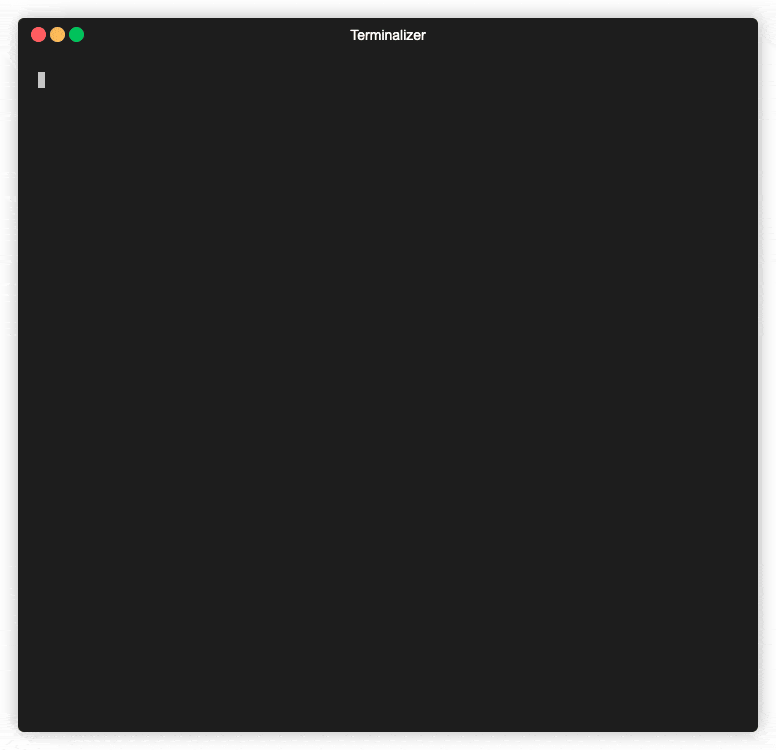
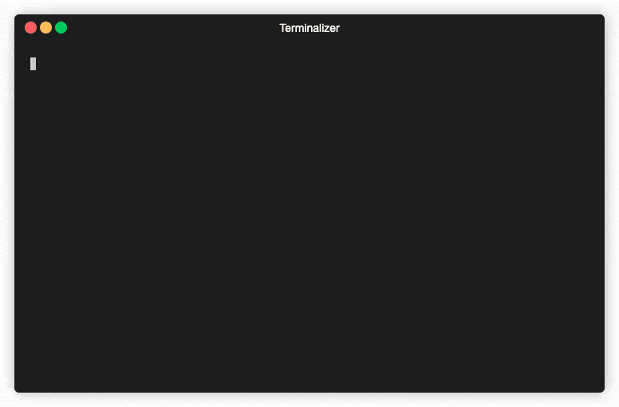
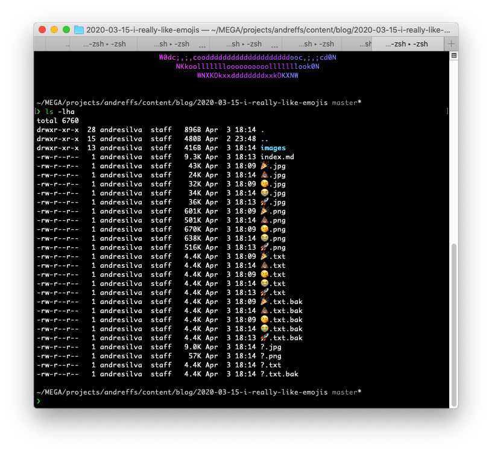

I came across a [blogpost](https://loige.co/random-emoji-in-your-prompt-how-and-why/) that explained how to add emoji's to your terminal prompt, something like this:


The post is pretty good!

Not only explains how to add emoji's to you prompt, but also goes a bit further on how to `$RANDOM` an emoji from a list of them, and bash formatting (customize the text in your terminal with colors and such).

Although I'm pretty happy with my terminal setup (**shameless plug** to 👉 [my dotfiles](https://github.com/andreffs18/dotfiles)👈 ), I kept coming back to this idea. It would be cool to use this, but instead of showing a random emoji in my prompt, use it as a "Welcome message" every time I open a new terminal session.

🤔

# Welcome

Every time I open a new session, a "rainbow-colored-ascii-art" reference to ["The circle game"](https://github.com/andreffs18/dotfiles/blob/c250398591c8c32ef54fc4d0cd7a988fcf4e2e15/config/system/.olhaaqui) just pops up on my terminal, making me a _very funny_ person around the office 🙃




The way it works is: on my `~/.bashrc` file, I am sourcing a text file with the ascii art of the "okay hand", piping it through "lolcat".
> [lolcat](https://github.com/busyloop/lolcat) is just a funny tool that colors everything that you pipe it through.

```bash
# ~/.bashrc
source ~/.olhaaqui | lolcat
```
> Source: https://github.com/andreffs18/dotfiles/blob/c250398591c8c32ef54fc4d0cd7a988fcf4e2e15/config/system/.olhaaqui


# Plan

Inspired by [Luciano's blogpost](https://loige.co/random-emoji-in-your-prompt-how-and-why/), I'm going to revamp my "Welcome" screen!

Instead of printing a big static ascii "you just lost the game" reference, I wanted to print a random emoji and for this I needed to find a way to convert an emoji to ascii art.

For the first version I just stored different ascii art emoji's in different files and randomly selected one to print.
It worked but was kinda clunky and not easy to add more. What if I wanted to add different emoji's? What if I wanted _allll emojies_ 😭 ?

So after a couple of iterations on the idea, I end up with the following plan:
1. The welcome screen should be a simple one-liner command
2. From a list of emoji's, select one, randomly (🙏 Luciano)
3. Find a way to get an image out of it
4. Convert the image to ascii art and print it on the terminal with `lolcat`, because it looks nice 🏳️‍🌈

## 1. One liner to rule them all

Alright! Changing my `~/.bashrc` is simple enough, I just need to move the code to a function and call it from there:

```bash
# ~/.bashrc
source ~/.functions
olhaaqui
```

```bash
# ~/.functions
function olhaaqui(){
  source ~/.olhaaqui | lolcat
}
```

## 2. Select an emoji

_Heavily inspired_ by Luciano's idea, we can change our `olhaaqui()` function to instead of sourcing a text file, to choose an emoji and print it:

```bash
# ~/.functions
function olhaaqui(){
  EMOJIES=(💩 🚀 ❗️ 😭 🎉 😘 👋)
  # Get random emoji from list
  EMOJI=${EMOJIES[$RANDOM % ${#EMOJIES[@]}]}
  echo $EMOJI
}
```

Although, running it a couple of times I started to notice that we would get an empty emoji every now and then.

To illustrate this, I'm storing the random index in a variable and printing it so we can visualize better what is happening:


# ~/.functions
function olhaaqui(){
  EMOJIES=(💩 🚀 ❗️ 😭 🎉 😘 👋)
  # Get random emoji from list
  INDEX=$(($RANDOM % ${#EMOJIES[@]}))
  EMOJI=${EMOJIES[$INDEX]}
  echo $INDEX $EMOJI
}



> As you can see by my highly technical testing method, sometimes we don't have emojis.

TL;DR from [stackoverflow](https://stackoverflow.com/questions/50427449/):
* **bash array indexing starts at 0 (always)**
* zsh array indexing starts at 1

This mean that we are returning values between **0 and len(emojies) - 1**. To fix this I opted to implement `max(INDEX, 1)`. This way if we get **zero** the function returns **one** instead.


# ~/.functions
function olhaaqui(){
  EMOJIES=(💩 🚀 ❗️ 😭 🎉 😘 👋)
  # Get random emoji from list
  INDEX=$(($RANDOM % ${#EMOJIES[@]}))
  INDEX=$(($INDEX>0 ? $INDEX : 1)) # max($INDEX, 1)
  EMOJI=${EMOJIES[$INDEX]}
  echo $INDEX $EMOJI
}




## 3. Download emojis automatically

Found this amazing [blogpost](https://emoji-domains.medium.com/free-emoji-image-generator-api-c0b7eaefa586) that has some example on to convert emojis to .png images. It works just like an API endpoint, where one of the parameters is the emoji itself.

For example: [**https://xn--i-7iq.ws/emoji-image/🚀.png?format\=emojione\&ar\=1x1**](https://xn--i-7iq.ws/emoji-image/🚀.png?format\=emojione\&ar\=1x1)

If you open the above link you can see that emoji as a .png image. Now we just need to download it. For that, we can rely on our good old `wget`:

```bash
$ wget "https://xn--i-7iq.ws/emoji-image/🚀.png?format\=emojione\&ar\=1x1" -O rocket.png
```

Awesome! We can now update our `olhaaqui()` snippet to also download the emoji image:


# ~/.functions
function olhaaqui(){
  EMOJIES=(💩 🚀 ❗️ 😭 🎉 😘 👋)
  # Get random emoji from list
  INDEX=$(($RANDOM % ${#EMOJIES[@]}))
  INDEX=$(($INDEX>0 ? $INDEX : 1)) # max($INDEX, 1)
  EMOJI=${EMOJIES[$INDEX]}
  # Download emoji .png image
  wget --quiet "https://xn--i-7iq.ws/emoji-image/$EMOJI.png?format\=emojione\&ar\=1x1" -O $EMOJI.png
}


## 4. Convert into Ascii art

Now we are just missing the ascii art! For that we can use [`jp2a`](https://github.com/cslarsen/jp2a), which is a simple command line util to convert jpegs into ascii.

Since our image is a .png, we also need to convert it from .png to .jpg format, which we can simply use the [`convert`](https://superuser.com/questions/71028/batch-converting-png-to-jpg-in-linux) command.

```bash
$ convert $EMOJI.png $EMOJI.jpg
$ jp2a --size=96x46 $EMOJI.jpg --output=$EMOJI.txt
```

Finally, we can just pipe our ascii art .txt through lolcat and thats it:


Hum, all white pixels are being converted to **"M"**. We can solve this by just replacing them with empty string:

```bash
$ sed -i.bak "s/M/ /g" $EMOJI.txt
```


Adding those commands to our `olhaaqui()` function looks like this:


# ~/.functions
function olhaaqui(){
  EMOJIES=(💩 🚀 ❗️ 😭 🎉 😘 👋)
  # Get random emoji from list
  INDEX=$(($RANDOM % ${#EMOJIES[@]}))
  INDEX=$(($INDEX>0 ? $INDEX : 1)) # max($INDEX, 1)
  EMOJI=${EMOJIES[$INDEX]}
  # Download emoji .png image
  wget --quiet "https://xn--i-7iq.ws/emoji-image/$EMOJI.png?format\=emojione\&ar\=1x1" -O $EMOJI.png
  # Convert to ascii art
  convert $EMOJI.png $EMOJI.jpg
  jp2a --size=96x46 $EMOJI.jpg --output=$EMOJI.txt
  # Replace "M" character with " " (empty character)
  sed -i.bak "s/M/ /g" $EMOJI.txt
  # Welcome!
  cat $EMOJI.txt | lolcat
}


# Cache it

This is working fine, but we can see that it's taking a bit of time to show our new "Welcome" screen.


This is because we are downloading an emoji image, and converting it to ascii, every time we open a new terminal session.
On top of that, we are creating a bunch of files on the directory we are opening the session. Over time, not only we make a bunch of unnecessary request but we also keep a bunch of files that are not used:



So, to keep this clean, we can create an _"emoji folder"_ to store all these files, and use that to check if should download the emoji again. The overall idea looks something like this:


graph TD
A[On opening a new terminal:] --> |"Pick an $EMOJI"| B
B{Do we have it<br>stored locally?} --> |No| C
B --> |Yes| Z
C["wget + convert + sed $EMOJI"] -->  D
D["Store it locally"] -->  Z
Z["$ cat $EMOJI | lolcat"]


We just need to add a couple of extra things to our `olhaaqui()` to make it work flawlessly:
* Create an "emoji" folder where we store all previously downloaded emoji's;
* "IF" emoji already exists, then use that one;
* Otherwise, do the whole "download + convert + sed" and also, delete all temporary .png, .jpg and .txt.bak files.
> Those files are generated from our script. The images can be deleted since they are just used to get to ascii art.
> The _.txt.bak_ file is created when we run the `sed` command with the `-i` flag. It overrides the original $EMOJI file but also generates a backup with the .bak extension.
> We don't need those.

```bash
function olhaaqui(){
  FOLDER=~/.emoji
  # Create folder if doesn't exist
  mkdir -p $FOLDER

  # Get random emoji from list
  EMOJIES=(💩 🚀 ❗️ 😭 🎉 😘 👋)
  EMOJI=${EMOJIES[$RANDOM % ${#EMOJIES[@]}]}

  # Check if emoji was previously used. If so use that, otherwise, download it.
  OLD_PWD=$(PWD)
  cd ~/
  if [ ! -f "$FOLDER/$EMOJI.txt" ] ; then
    echo "Downloading \"$EMOJI\"..."
    # Download image using Emoji API
    wget --quiet "https://xn--i-7iq.ws/emoji-image/$EMOJI.png?format\=emojione\&ar\=1x1" -O $FOLDER/$EMOJI.png
    # Convert image from .png to .jpg
    convert $FOLDER/$EMOJI.png $FOLDER/$EMOJI.jpg
    # Convert image to ascii art
    jp2a --size=96x46 $FOLDER/$EMOJI.jpg --output=$FOLDER/$EMOJI.txt
    # Replace all border "M" characters with empty space
    sed -i.bak "s/M/ /g" $FOLDER/$EMOJI.txt
    # Delete temp files
    rm $FOLDER/$EMOJI.png $FOLDER/$EMOJI.jpg $FOLDER/$EMOJI.txt.bak
  fi
  cd $OLD_PWD
  # Print image
  cat $FOLDER/$EMOJI.txt | lolcat
}
```

Moving this to your `~/.bashrc` and you'll have the following:


# Resources
* Luciano's blogpost on adding emojis to your prompt: https://loige.co/random-emoji-in-your-prompt-how-and-why/
* The circle game: https://knowyourmeme.com/memes/the-circle-game
* Download Emoji's API: https://emoji-domains.medium.com/free-emoji-image-generator-api-c0b7eaefa586
* How to convert from .png to .jpg: https://superuser.com/questions/71028/batch-converting-png-to-jpg-in-linux
* Convert .jpg file to Ascii Art: https://github.com/cslarsen/jp2a
* `lolcat` utility https://github.com/busyloop/lolcat

👋
