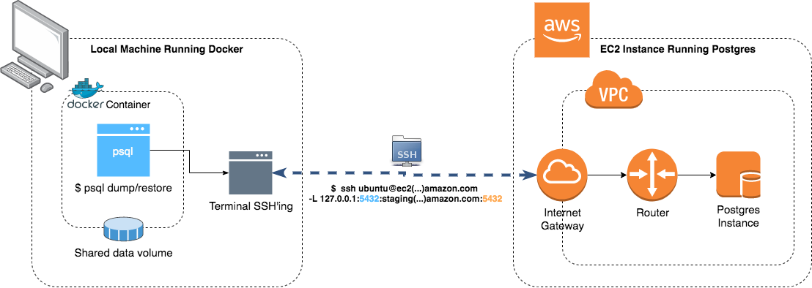

More often than not, I end up going online to look up on how to use docker as the middle man on interacting with Postgres.
> Usually for me its Postgres, but this "recipe" can be applied to any piece of software that has more than one version which you don't have installed on your laptop.

Because of this whole back and forth I compiled a small list of "how-tos" to help me remember.

# Dump

This exercise is to collect a database dump, from a machine on EC2 to my local computer. The version of the database that I have running is 11.6 and locally I just have 9.6

> To dump your projects database you need to run the ```pg_dump``` command. Depending on the version you can have slight differences so, consult the documentation to know exactly what your version needs.

First things first, you need to open an ssh tunnel to your Postgres instance:

```bash
$ ssh ubuntu@ec2-38-234-54-173.eu-west-1.compute.amazonaws.com -L 127.0.0.1:5432:staging.iisdj13.eu-west-1.rds.amazonaws.com:5432
```

Notice that we are opening the local port `5432`. This is the port that we will use to run our commands against our remove machine.

Now, we need to create a folder to save our backup and start a docker container with the specific version:

```bash
$ mkdir dump
$ docker run --rm --net=host -it -v $(pwd)/dump:/dump postgres:11-alpine /bin/bash
[docker-bash] $ pg_dump -Fc -h host.docker.internal -U staging_user --port 5432 --dbname staging_db > dump/staging_db_$(date +%Y-%m-%d).dump
```

There are a couple of things going on here, the important being:
* We start a docker container with the same postgres version as the one running on EC2. Notice the param `--net=host`: We are configuring it to share the same network as our machine. This will allow us to reach the ssh tunnel from inside the docker image. We also setup a shared volume between docker and our machine (`-v $(pwd)/dump:/dump`) so we can save the backup in our local disk and not only inside the container.
* We execute the `pg_dump` command from version 11. The important part is the `--host=host.docker.internal` which tells docker to configure the container to use the same IP as the local machine.
* The `$(date..)` its just a nicety to timestamp the backup 😉.


**Note** that the important part is making sure you are using the correct port number and correct postgres version. The rest should be pretty straightforward!

# Restore

To restore the previously saved database backup (using the point above) in a local instance of the database, we just need to setup docker with the correct postgres version and run the `pg_restore` command.


```bash
$ docker run --rm --net=host -it -v $(pwd)/dump:/dump postgres:11-alpine /bin/bash
[docker-bash] $ pg_restore -C --no-owner --role=local_user --host host.docker.internal --port 5432 --dbname local_db -U local_user staging_db_2020-02-21.dump
```

> The ```--no-owner --role=local_user``` is necessary in case of having a Production/Staging dump.
> Its possible that the database user on our Production database is different from the one on Staging or Local, so we need to tell `pg_restore` command to overwrite the role with the new one. If both roles are the same, those options can be discarded.


# Resources:

* https://robotmoon.com/ssh-tunnels/
