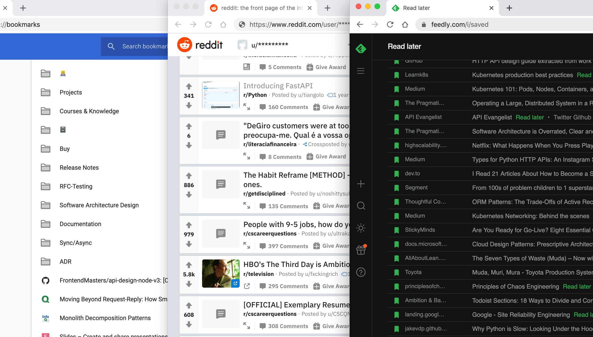
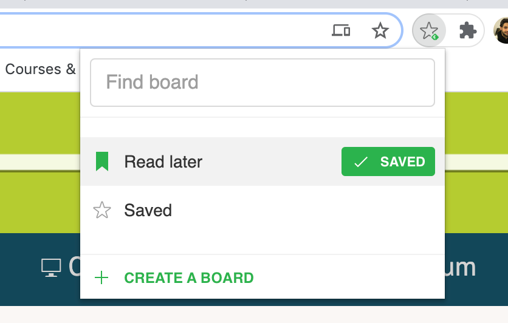
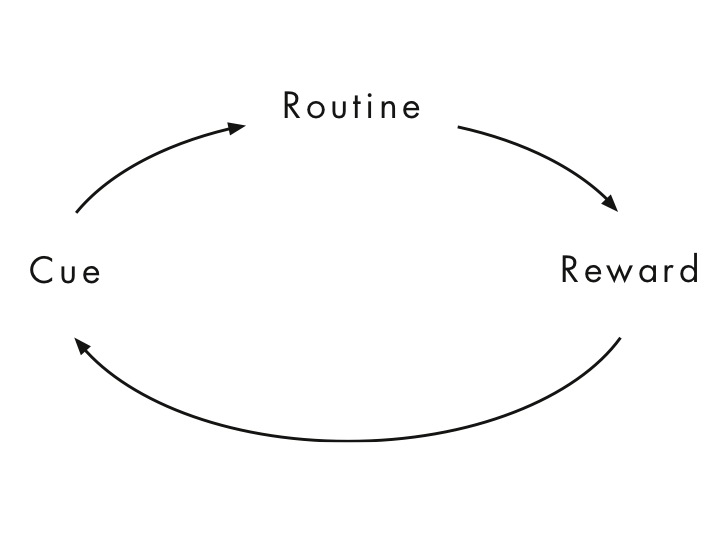
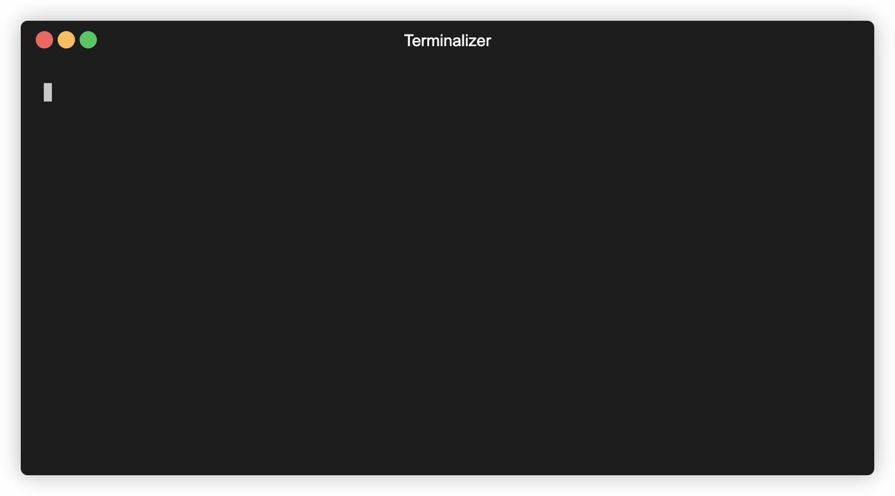

Since this _#remotelife_ began, sadly not for the best reasons, I've been able to finally clean my backlog of, guess what, TV Shows, Games, Podcasts, Books... Well, everything that a person is suppose to do!

Very happy was I until I remembered that, maybe I should start looking into the **"To Read"** bookmarks, **"Saved"** on Reddit and, the holy grail, **"Read Later"** of Feedly.



While the "Saved" section on Reddit was mostly threads from [/r/cscarrearquestions](https://www.reddit.com/r/cscareerquestions/) (and some memes from [/r/wsb](https://www.reddit.com/r/wallstreetbets) 😂) the other two places were actual interesting articles that I have planned on reading.

So, I started reading a couple of those a day and soon realized that:
1. I should make this part of my routine, like everyday open a _"Save for Later"_ article; 🤔
2. Why wasn’t I reading these more often;
3. There are articles that could complement some books that I read in the past.

# To Read or To Save?

I realized that for me to have +300 articles on Feedly to "Read Later", my process would consist of something like:

* Every time I'm waiting for someone (or [most likely in the bathroom]()), I would scroll on Feedly for a bit and **not read anything**, only mark the article as to "Read Later".

The same thing with links that some of my friends shared with me:
* Open them, realized they are too long -> "Read Later" on Feedly.



> I use the ["Save to Feedly Board"](https://chrome.google.com/webstore/detail/save-to-feedly-board/hdhblphcdjcicefneapkhmleapfaocih) Chrome extension which allows me to just [CMD + D] and save any website into my "Read Later" board.

Since reading a couple of these a days was proving to be very productive, I wanted to make sure I was keeping up with it, and to do that **why not force it upon me via _le amazing over-engineering_ 🥖**.

# Automate everything

Having decided to read at least one article a day, I had to figure out how would I efforce that. Since I'm an engineer and I like to overthink most things, I though that it would be acceptable to just get a random article from that list, _automatically_.

Not only I would be surprised (_"oh damn, I forgot I saved this"_, type of situation) but also, I would have a topic that I could focus on that day.

So here comes the question: **What should be the cue for me to read an article?**



> Pretty much the whole framework developed on the book [The Power of Habit](https://www.amazon.com/Power-Habit-What-Life-Business-ebook/dp/B0055PGUYU).


## Where do I spend most of my time?

💻 Terminal.

That's it! Every time I open a new tab on my terminal, I get a new article from my "Read Later" on Feedly!




> If you're wondering about the giant 😭, you can check out ["I really like emoji's"](/blog/i-really-like-emojis/) blogpost.

# Plan

TL;DR: made a simple alias function, that runs a Python script that gets all "Read Later" articles from Feedly and randomly opens one on a web browser 👌.


## "Save for later" alias

The "[sfl()](https://github.com/andreffs18/dotfiles/blob/master/config/system/.functions#L59)" bash function would only need two things:
* Run the Python script
* Pass any arguments to it (just in case I wanted to open more than one article)

```bash
# Shortcut to get a random article from my Feedly account from the "Saved for Later" tag
# eg: $ sfl 10
function sfl(){
  python3 $HOME/.dotfiles/bin/feedly_read_later.py $1
}
```

Then I just needed to run this function every time I open a terminal:

```
# on my ~/.zshrc
(...)

sfl 1
```

## Codifying it

I endup doing this in Python because it was taking to much time for me to build it in bash 😅. The overall logic for it would be something like this:


graph TD
A[Get accound id from Feedly]
B[Get stream of 'Saved' articles]
C{Has articles?}
D[Append articles onto list]
E[Choose random articles]
F[Open articles on browser]
A --> B
B --> C
C --> |Yes|D
D --> B
C --> |No| E
E --> F



With this in mind let's check Feedly's API.

## Feedly API

And oh boy, I was not expecting it to be so dificult:
* Broken links everywhere;
* Most of it ```[deprecated]```;
* Not the best documentation.


End up looking on stack overflow (of course) and [this guy](https://rud.is/b/2018/04/16/by-request-retrieving-your-feedly-saved-for-later-entries/) for guidance, but the overall way to get your "Saved for Later" feed is to get you profile id, which then can be used to get the "stream" (not entries or feed) tagged as ```"global.saved"```.

Then we just need to keep going through their pagination until we reach the end of the feed:

> "The streams APIs offer pagination through the ```continuation``` value, which can be used to fetch the next page of entry ids or content. If the server doesn’t return a ```continuation value``` in its response, you’ve reached the end of the stream" - https://developer.feedly.com/v3/streams/


### Python Script

Implementing it in Python then is really straight forward:


```python
# Initialize requests session
FEEDLY_TOKEN = os.environ["FEEDLY_TOKEN"]
FEEDLY_URL = "https://cloud.feedly.com/v3"
request = requests.Session()
request.headers.update(
    {"Content-Type": "application/json", "Authorization": f"OAuth {FEEDLY_TOKEN}"}
)

# Get profile id
response = request.get(FEEDLY_URL + "/profile")
profile_id = response.json()["id"]

# Iter over "global.saved" stream
articles = []
stream_id = f'user/{profile_id}/tag/global.saved'
continuation = ""
while True:
    # Query feedly API to get all Saved articles, and parse all Article ids, storing them in `articles` variable.
    try:
        response = request.get(FEEDLY_URL + f"/streams/contents?streamId={stream_id}&continuation={continuation}")
        items = response.json()["items"]
        articles.extend([item.get("id") for item in items])
    except:
        # Might have hit the threshold of requests. Stop fetching and just use the ones we already have
        break

    # Then check if is there any more pages left, if not, break out of the while loop.
    try:
        continuation = response.json()["continuation"]
    except KeyError:
        break

# Print message and finally open article on a web browser.
print(f'\n✅ Found {len(articles)} articles in "Saved for later"!')
article = random.choice(articles)
webbrowser.open(f"https://feedly.com/i/entry/{article}")
```

> You can check the complete script on [dotfiles/bin/feedly_read_later.py](https://github.com/andreffs18/dotfiles/blob/master/bin/feedly_read_later.py)


# Conclusions

* Realized that I have a lot of articles that float around the same topics (Frontend, Backend, CI/CD, etc) and that it would be great to aggregate those so I dont jump around between topics;
* I could save a cache of all articles locally (on a .txt file or something), and update it after like 15 days.
* I've notice that my behavior has changed regarding terminal tabs. Now I tend to keep myself centered around 4 tabs, whereas before it was a lot more!
* Since Feedly access token only works for 30 days, I end up also creating another alias that updates the token in my environment. Although its much more manual (still need to check my email and open an link 🙃) its fine since I only need to run it every so ofter. You can find it on my dotfiles "[update_feedly_token()](https://github.com/andreffs18/dotfiles/blob/master/config/system/.functions#L63-L74)".


If you got his far I have a question: How can you do this in bash? Or just better? Fewer lines of code? One liner?! 😱

Alright, cya! 👋
