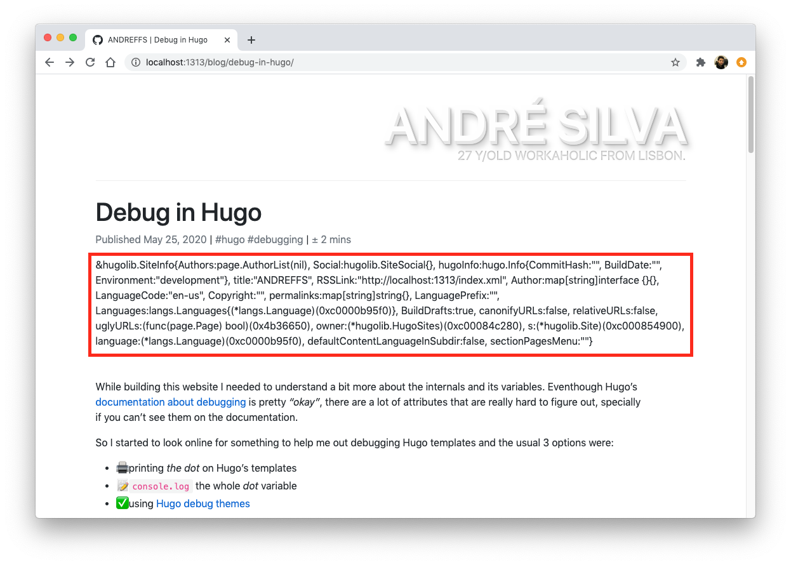
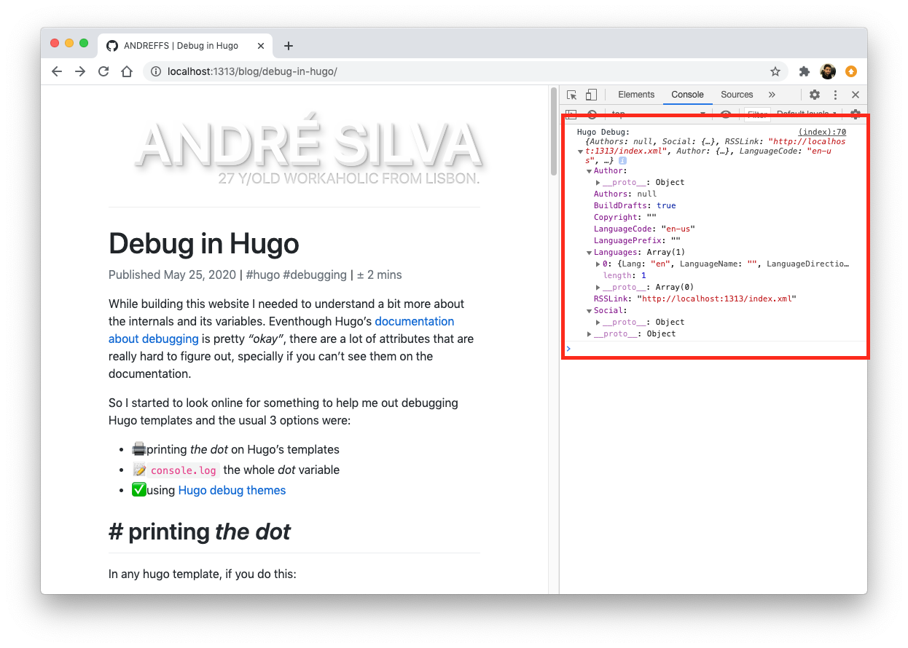
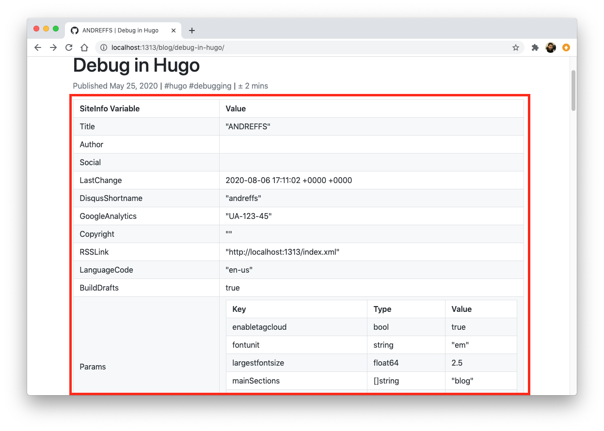

While building this website I needed to understand a bit more about the internals and its variables. Eventhough Hugo's [documentation about debugging](https://gohugo.io/templates/template-debugging/) is pretty _"okay"_, there are a lot of attributes that are really hard to figure out, specially if you can't see them on the documentation.

So I started to look online for something to help me out debugging Hugo templates and the usual 3 options were:

- 🖨 printing _the dot_ on Hugo's templates
- 📝 `console.log` the whole _dot_ variable
- ✅ using [Hugo debug themes](https://github.com/kaushalmodi/hugo-debugprint)

# Printing _"the dot"_

In any hugo template, if you do this:

```html
{{ printf "%#v" . }}
```

You'll get something like this:



Which to be honest is not the best dev friendly output to figure out what can you use. Also, it hiddes a lot of variables that you have access to, for example, printing the ```site``` variable only shows this:

```go
// {{ printf "%#v" site }}
&hugolib.SiteInfo{
	Authors:page.AuthorList(nil),
	Social:hugolib.SiteSocial{},
	hugoInfo:hugo.Info{
		CommitHash:"",
		BuildDate:"",
		Environment:"development"
	},
	title:"ANDREFFS",
	RSSLink:"http://localhost:1313/index.xml",
	Author:map[string]interface {}{},
	LanguageCode:"en-us",
	Copyright:"",
	permalinks:map[string]string{},
	LanguagePrefix:"",
	Languages:langs.Languages{(*langs.Language)(0xc0000b95f0)},
	BuildDrafts:true,
	canonifyURLs:false,
	relativeURLs:false,
	uglyURLs:(func(page.Page) bool)(0x4b36650),
	owner:(*hugolib.HugoSites)(0xc00084c280),
	s:(*hugolib.Site)(0xc000854900),
	language:(*langs.Language)(0xc0000b95f0),
	defaultContentLanguageInSubdir:false,
	sectionPagesMenu:""
}
```
When you also have access to ```site.Params```, which is not showing on the above output:

```go
// {{ printf "%#v" site.Params }}
maps.Params{
  "enabletagcloud":true,
  "fontunit":"em",
  "largestfontsize":2.5,
  "mainSections":[]string{"blog"},
  "mainsections":[]string{"blog"},
  "smallestfontsize":1
}
```

# Console.log everything

In your html files, put a snippet like the following:

```html
<script>
  var hugoLog = JSON.parse({{ jsonify . }});
  console.log('Hugo Debug: ', hugoLog);
</script>
```


This will log the same object that we had with the previous approach, but you can manipulate it on the browser's console tab. You can always move that snippet into a [shortcode](https://gohugo.io/content-management/shortcodes/) and use it like this whenever you need to debug something. 🤔

```html
// layouts/partials/console_log.html
<script>
  var hugoLog = JSON.parse({{ jsonify . }});
  console.log('Hugo Debug: ', hugoLog);
</script>

// layouts/_default/single.html
{{ define "main" }}
<div class="container">
  {{ partial "console-log" $someVariable }}
  {{ .Content }}
</div>
{{ end }}
```

Although this way is nicer (I can play around with the object) it still doesn't show me all available variables.

> There was also a similar solution posted on [hugo's discourse forums](https://discourse.gohugo.io/t/need-better-debugging-support/12071/2) that involves in `console.log` every variable, which seems to be a bit _to much_. Although if we put it in a partial, its kinda cool.

# Using Hugo debug themes

Basically, the two options combined 😄.

We just need to [install it](https://github.com/kaushalmodi/hugo-debugprint#usage), add `hugo-debugprint` to our `themes` variable on our **config.toml** and use the shortcode that the template offers:

```toml
# config.toml
theme = ["hugo-debugprint"]

# /layouts/_default/single.html
{{ partial "debugprint.html" site }}
```




# Resources
- Printing _"the dot"_: https://discourse.gohugo.io/t/howto-show-what-values-are-passed-to-a-template/41
- Console.log everything: https://discourse.gohugo.io/t/easier-debugging-hugo-variables-using-the-javascript-console/22873
- Using Hugo debug themes: https://github.com/kaushalmodi/hugo-debugprint
- Context variables: https://www.smashingmagazine.com/2021/02/context-variables-hugo-static-site-generator/